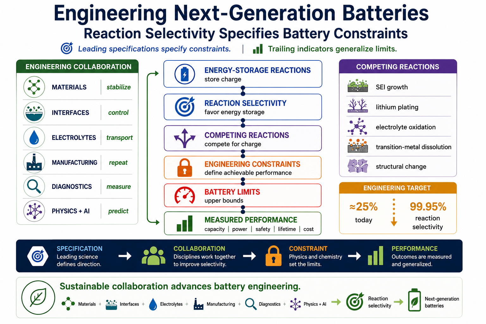

# Engineering Next-Generation Batteries

**Reaction Selectivity Specifies Battery Constraints**

This repository is an open engineering roadmap for next-generation batteries. It organizes battery research around leading engineering specifications, sustainable collaboration, engineering constraints, and measured performance.



## Core idea

Battery engineering becomes clearer when reaction selectivity is treated as a leading specification:

```text
Energy-storage reactions
        ↓
Reaction selectivity
        ↓
Competing reactions
        ↓
Engineering constraints
        ↓
Battery limits
        ↓
Measured performance
```

Engineering collaboration supports the spine:

| Area | Engineering action |
|---|---|
| Materials | stabilize |
| Interfaces | control |
| Electrolytes | transport |
| Manufacturing | repeat |
| Diagnostics | measure |
| Physics + AI | predict |

## Roadmap notebooks

| Notebook | Theme | Status |
|---|---|---|
| `00_context.ipynb` | Engineering objective and constraint map | starter |
| `07_reaction_pathways.ipynb` | Energy-storage and competing pathways | planned |
| `13_reaction_selectivity.ipynb` | Selectivity as a leading specification | planned |
| `17_interfaces.ipynb` | Interface control and stability | planned |
| `23_electrolytes.ipynb` | Transport, windows, and compatibility | planned |
| `29_manufacturing.ipynb` | Repeatability and scalable quality | planned |
| `37_diagnostics.ipynb` | Measuring degradation and health | planned |
| `43_modeling_ai.ipynb` | Physics-informed prediction | planned |
| `49_constraint_graphs.ipynb` | Integrated design graph | planned |
| `53_future_chemistries.ipynb` | Viable alternatives and open questions | planned |

## Install

```bash
python -m venv .venv
source .venv/bin/activate
pip install -r requirements.txt
```

## License

MIT License.

This repository is intended as an open engineering resource. Contributions, forks, and adaptations are encouraged when they improve understanding or advance practical battery engineering.
